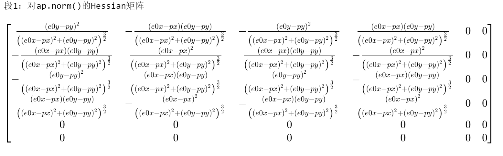
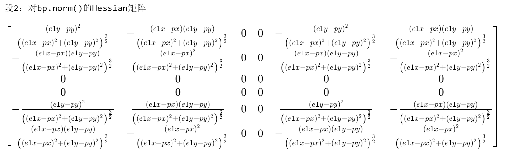

# IP-sim 

IP(Incremental-potential)-based simulation written in rust.

## Note:
- Contact-IP entrance: `damped_newton_with_contact.rs` function `fill_frame`

## TODO:
- Getting stuck:
    - `toi = 0` for certain position, causing infinite loop
- Test contact IP
    - Verify `ContactPair::distance_grad` and `ContactPair::distance_hess`
    - Verify `ContactPairIp::append_grad` and `ContactPairIp::append_hess`
    

## Derivatives
1. grad
```text
段1：对ap.norm()求导
对px的导数: (-e_0x + p_x)/sqrt((e_0x - p_x)**2 + (e_0y - p_y)**2)
对py的导数: (-e_0y + p_y)/sqrt((e_0x - p_x)**2 + (e_0y - p_y)**2)
对e0x的导数: (e_0x - p_x)/sqrt((e_0x - p_x)**2 + (e_0y - p_y)**2)
对e0y的导数: (e_0y - p_y)/sqrt((e_0x - p_x)**2 + (e_0y - p_y)**2)
对e1x的导数: 0
对e1y的导数: 0
```

```text
段2：对bp.norm()求导
对px的导数: (-e1x + px)/sqrt((e1x - px)**2 + (e1y - py)**2)
对py的导数: (-e1y + py)/sqrt((e1x - px)**2 + (e1y - py)**2)
对e0x的导数: 0
对e0y的导数: 0
对e1x的导数: (e1x - px)/sqrt((e1x - px)**2 + (e1y - py)**2)
对e1y的导数: (e1y - py)/sqrt((e1x - px)**2 + (e1y - py)**2)

```

```text
段3：对(p - proj_point).norm()求导
对px的导数: (-(-e0x + e1x)*(-e0y + e1y)*Abs(-e0y + py - (-e0y + e1y)*((-e0x + e1x)*(-e0x + px) + (-e0y + e1y)*(-e0y + py))/((-e0x + e1x)**2 + (-e0y + e1y)**2))*sign(-e0y + py - (-e0y + e1y)*((-e0x + e1x)*(-e0x + px) + (-e0y + e1y)*(-e0y + py))/((-e0x + e1x)**2 + (-e0y + e1y)**2))/((-e0x + e1x)**2 + (-e0y + e1y)**2) + (-(-e0x + e1x)**2/((-e0x + e1x)**2 + (-e0y + e1y)**2) + 1)*Abs(-e0x + px - (-e0x + e1x)*((-e0x + e1x)*(-e0x + px) + (-e0y + e1y)*(-e0y + py))/((-e0x + e1x)**2 + (-e0y + e1y)**2))*sign(-e0x + px - (-e0x + e1x)*((-e0x + e1x)*(-e0x + px) + (-e0y + e1y)*(-e0y + py))/((-e0x + e1x)**2 + (-e0y + e1y)**2)))/sqrt(Abs(-e0x + px - (-e0x + e1x)*((-e0x + e1x)*(-e0x + px) + (-e0y + e1y)*(-e0y + py))/((-e0x + e1x)**2 + (-e0y + e1y)**2))**2 + Abs(-e0y + py - (-e0y + e1y)*((-e0x + e1x)*(-e0x + px) + (-e0y + e1y)*(-e0y + py))/((-e0x + e1x)**2 + (-e0y + e1y)**2))**2)
对py的导数: (-(-e0x + e1x)*(-e0y + e1y)*Abs(-e0x + px - (-e0x + e1x)*((-e0x + e1x)*(-e0x + px) + (-e0y + e1y)*(-e0y + py))/((-e0x + e1x)**2 + (-e0y + e1y)**2))*sign(-e0x + px - (-e0x + e1x)*((-e0x + e1x)*(-e0x + px) + (-e0y + e1y)*(-e0y + py))/((-e0x + e1x)**2 + (-e0y + e1y)**2))/((-e0x + e1x)**2 + (-e0y + e1y)**2) + (-(-e0y + e1y)**2/((-e0x + e1x)**2 + (-e0y + e1y)**2) + 1)*Abs(-e0y + py - (-e0y + e1y)*((-e0x + e1x)*(-e0x + px) + (-e0y + e1y)*(-e0y + py))/((-e0x + e1x)**2 + (-e0y + e1y)**2))*sign(-e0y + py - (-e0y + e1y)*((-e0x + e1x)*(-e0x + px) + (-e0y + e1y)*(-e0y + py))/((-e0x + e1x)**2 + (-e0y + e1y)**2)))/sqrt(Abs(-e0x + px - (-e0x + e1x)*((-e0x + e1x)*(-e0x + px) + (-e0y + e1y)*(-e0y + py))/((-e0x + e1x)**2 + (-e0y + e1y)**2))**2 + Abs(-e0y + py - (-e0y + e1y)*((-e0x + e1x)*(-e0x + px) + (-e0y + e1y)*(-e0y + py))/((-e0x + e1x)**2 + (-e0y + e1y)**2))**2)
对e0x的导数: ((-(-2*e0x + 2*e1x)*(-e0y + e1y)*((-e0x + e1x)*(-e0x + px) + (-e0y + e1y)*(-e0y + py))/((-e0x + e1x)**2 + (-e0y + e1y)**2)**2 - (-e0y + e1y)*(2*e0x - e1x - px)/((-e0x + e1x)**2 + (-e0y + e1y)**2))*Abs(-e0y + py - (-e0y + e1y)*((-e0x + e1x)*(-e0x + px) + (-e0y + e1y)*(-e0y + py))/((-e0x + e1x)**2 + (-e0y + e1y)**2))*sign(-e0y + py - (-e0y + e1y)*((-e0x + e1x)*(-e0x + px) + (-e0y + e1y)*(-e0y + py))/((-e0x + e1x)**2 + (-e0y + e1y)**2)) + (-(-2*e0x + 2*e1x)*(-e0x + e1x)*((-e0x + e1x)*(-e0x + px) + (-e0y + e1y)*(-e0y + py))/((-e0x + e1x)**2 + (-e0y + e1y)**2)**2 - (-e0x + e1x)*(2*e0x - e1x - px)/((-e0x + e1x)**2 + (-e0y + e1y)**2) + ((-e0x + e1x)*(-e0x + px) + (-e0y + e1y)*(-e0y + py))/((-e0x + e1x)**2 + (-e0y + e1y)**2) - 1)*Abs(-e0x + px - (-e0x + e1x)*((-e0x + e1x)*(-e0x + px) + (-e0y + e1y)*(-e0y + py))/((-e0x + e1x)**2 + (-e0y + e1y)**2))*sign(-e0x + px - (-e0x + e1x)*((-e0x + e1x)*(-e0x + px) + (-e0y + e1y)*(-e0y + py))/((-e0x + e1x)**2 + (-e0y + e1y)**2)))/sqrt(Abs(-e0x + px - (-e0x + e1x)*((-e0x + e1x)*(-e0x + px) + (-e0y + e1y)*(-e0y + py))/((-e0x + e1x)**2 + (-e0y + e1y)**2))**2 + Abs(-e0y + py - (-e0y + e1y)*((-e0x + e1x)*(-e0x + px) + (-e0y + e1y)*(-e0y + py))/((-e0x + e1x)**2 + (-e0y + e1y)**2))**2)
对e0y的导数: ((-(-e0x + e1x)*(-2*e0y + 2*e1y)*((-e0x + e1x)*(-e0x + px) + (-e0y + e1y)*(-e0y + py))/((-e0x + e1x)**2 + (-e0y + e1y)**2)**2 - (-e0x + e1x)*(2*e0y - e1y - py)/((-e0x + e1x)**2 + (-e0y + e1y)**2))*Abs(-e0x + px - (-e0x + e1x)*((-e0x + e1x)*(-e0x + px) + (-e0y + e1y)*(-e0y + py))/((-e0x + e1x)**2 + (-e0y + e1y)**2))*sign(-e0x + px - (-e0x + e1x)*((-e0x + e1x)*(-e0x + px) + (-e0y + e1y)*(-e0y + py))/((-e0x + e1x)**2 + (-e0y + e1y)**2)) + (-(-2*e0y + 2*e1y)*(-e0y + e1y)*((-e0x + e1x)*(-e0x + px) + (-e0y + e1y)*(-e0y + py))/((-e0x + e1x)**2 + (-e0y + e1y)**2)**2 - (-e0y + e1y)*(2*e0y - e1y - py)/((-e0x + e1x)**2 + (-e0y + e1y)**2) + ((-e0x + e1x)*(-e0x + px) + (-e0y + e1y)*(-e0y + py))/((-e0x + e1x)**2 + (-e0y + e1y)**2) - 1)*Abs(-e0y + py - (-e0y + e1y)*((-e0x + e1x)*(-e0x + px) + (-e0y + e1y)*(-e0y + py))/((-e0x + e1x)**2 + (-e0y + e1y)**2))*sign(-e0y + py - (-e0y + e1y)*((-e0x + e1x)*(-e0x + px) + (-e0y + e1y)*(-e0y + py))/((-e0x + e1x)**2 + (-e0y + e1y)**2)))/sqrt(Abs(-e0x + px - (-e0x + e1x)*((-e0x + e1x)*(-e0x + px) + (-e0y + e1y)*(-e0y + py))/((-e0x + e1x)**2 + (-e0y + e1y)**2))**2 + Abs(-e0y + py - (-e0y + e1y)*((-e0x + e1x)*(-e0x + px) + (-e0y + e1y)*(-e0y + py))/((-e0x + e1x)**2 + (-e0y + e1y)**2))**2)
对e1x的导数: ((-(-e0x + px)*(-e0y + e1y)/((-e0x + e1x)**2 + (-e0y + e1y)**2) - (2*e0x - 2*e1x)*(-e0y + e1y)*((-e0x + e1x)*(-e0x + px) + (-e0y + e1y)*(-e0y + py))/((-e0x + e1x)**2 + (-e0y + e1y)**2)**2)*Abs(-e0y + py - (-e0y + e1y)*((-e0x + e1x)*(-e0x + px) + (-e0y + e1y)*(-e0y + py))/((-e0x + e1x)**2 + (-e0y + e1y)**2))*sign(-e0y + py - (-e0y + e1y)*((-e0x + e1x)*(-e0x + px) + (-e0y + e1y)*(-e0y + py))/((-e0x + e1x)**2 + (-e0y + e1y)**2)) + (-(-e0x + e1x)*(-e0x + px)/((-e0x + e1x)**2 + (-e0y + e1y)**2) - (-e0x + e1x)*(2*e0x - 2*e1x)*((-e0x + e1x)*(-e0x + px) + (-e0y + e1y)*(-e0y + py))/((-e0x + e1x)**2 + (-e0y + e1y)**2)**2 - ((-e0x + e1x)*(-e0x + px) + (-e0y + e1y)*(-e0y + py))/((-e0x + e1x)**2 + (-e0y + e1y)**2))*Abs(-e0x + px - (-e0x + e1x)*((-e0x + e1x)*(-e0x + px) + (-e0y + e1y)*(-e0y + py))/((-e0x + e1x)**2 + (-e0y + e1y)**2))*sign(-e0x + px - (-e0x + e1x)*((-e0x + e1x)*(-e0x + px) + (-e0y + e1y)*(-e0y + py))/((-e0x + e1x)**2 + (-e0y + e1y)**2)))/sqrt(Abs(-e0x + px - (-e0x + e1x)*((-e0x + e1x)*(-e0x + px) + (-e0y + e1y)*(-e0y + py))/((-e0x + e1x)**2 + (-e0y + e1y)**2))**2 + Abs(-e0y + py - (-e0y + e1y)*((-e0x + e1x)*(-e0x + px) + (-e0y + e1y)*(-e0y + py))/((-e0x + e1x)**2 + (-e0y + e1y)**2))**2)
对e1y的导数: ((-(-e0x + e1x)*(-e0y + py)/((-e0x + e1x)**2 + (-e0y + e1y)**2) - (-e0x + e1x)*(2*e0y - 2*e1y)*((-e0x + e1x)*(-e0x + px) + (-e0y + e1y)*(-e0y + py))/((-e0x + e1x)**2 + (-e0y + e1y)**2)**2)*Abs(-e0x + px - (-e0x + e1x)*((-e0x + e1x)*(-e0x + px) + (-e0y + e1y)*(-e0y + py))/((-e0x + e1x)**2 + (-e0y + e1y)**2))*sign(-e0x + px - (-e0x + e1x)*((-e0x + e1x)*(-e0x + px) + (-e0y + e1y)*(-e0y + py))/((-e0x + e1x)**2 + (-e0y + e1y)**2)) + (-(-e0y + e1y)*(-e0y + py)/((-e0x + e1x)**2 + (-e0y + e1y)**2) - (-e0y + e1y)*(2*e0y - 2*e1y)*((-e0x + e1x)*(-e0x + px) + (-e0y + e1y)*(-e0y + py))/((-e0x + e1x)**2 + (-e0y + e1y)**2)**2 - ((-e0x + e1x)*(-e0x + px) + (-e0y + e1y)*(-e0y + py))/((-e0x + e1x)**2 + (-e0y + e1y)**2))*Abs(-e0y + py - (-e0y + e1y)*((-e0x + e1x)*(-e0x + px) + (-e0y + e1y)*(-e0y + py))/((-e0x + e1x)**2 + (-e0y + e1y)**2))*sign(-e0y + py - (-e0y + e1y)*((-e0x + e1x)*(-e0x + px) + (-e0y + e1y)*(-e0y + py))/((-e0x + e1x)**2 + (-e0y + e1y)**2)))/sqrt(Abs(-e0x + px - (-e0x + e1x)*((-e0x + e1x)*(-e0x + px) + (-e0y + e1y)*(-e0y + py))/((-e0x + e1x)**2 + (-e0y + e1y)**2))**2 + Abs(-e0y + py - (-e0y + e1y)*((-e0x + e1x)*(-e0x + px) + (-e0y + e1y)*(-e0y + py))/((-e0x + e1x)**2 + (-e0y + e1y)**2))**2)

```

```

2. Hessian



Hess3: *todo*
